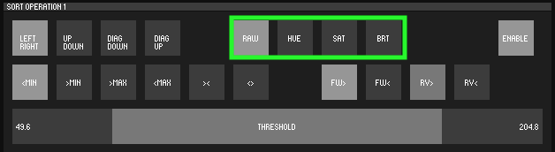

# CrossSort

An operation based pixel sorting tool by Phillip David Stearns for GlitchTextiles GlitchTools.

Hat tip to [Kim Asendorf](https://github.com/kimasendorf/ASDFPixelSort) for pioneering pixel sorting as a creative image processsing technique.

### Overview

* Installation
* Usage
* Theory of Operation

## Installation

1. Download the latest version of Processing3 from [here](https://processing.org/download/) or by using Homebrew: `brew install --cask processing`
1. Install ControlP5 from the Contribution Manager tool in the Processing IDE
1. Clone this repo: `git clone https://github.com/GlitchTextiles/CrossSort.git`
1. Open `CrossSort.pde` in Processing.
1. Click the "Run" button in Processing.

## Usage

### Open A File

Click `OPEN` to Select an image to process (`.png`, `.jpg`, `.jp2`, `.tif`, `.tiff`, `.gif`, `.bmp`). Generally this should not be a very high resolution file. Try a 1280x720 px to get familiar with the controls.

### Enable a SortOperation

Click `ENABLE` to enable a SortOperation. SortOperation is a class that performs the sorting based on chosen parameters. Up to four parameters are provided and executed sequenctially.

### Select Direction

* `LEFT RIGHT` - Sort along the x-axis, gather pixels from left to right.
* `UP DOWN` - Sort along the y-axis, gather pixels from top to bottom.
* `DIAG DOWN` - Sort diagonally, gather pixels top to bottom, left to right.
* `DIAG UP` - Sort diagonally, gather pixels bottom to top, left to right.

### Select Pixel Value Evaluation Mode

Evaluate pixels based on their:

* `RAW` - 32bit ARGB value
* `HUE` - hue
* `SAT` - saturation
* `BRT` - brightness

### Select Threshold Logic

Samples are selected when they fall:

* `<MIN` - below the `MIN` threshold
* `>MIN` - above the `MIN` threshold
* `>MAX` - above the `MAX` threshold
* `<MAX` - below the `MAX` threshold
* `><` - above the `MIN` and below the `MAX` threshold
* `<>` - below the `MIN` and above the `MAX` threshold

### Select Pixel Evaluation Direction and Logic

Iterates through the sample:

* `FW<` - counting up, swaps pixels if the current is less than the next.
* `FW>` - counting up, swaps pixels if the current is greater than the next.
* `RV<` - counting down, swaps pixels if the current is less than the next.
* `RV>` - counting down, swaps pixels if the current is greater than the next.

### Set the Threshold min and max 

The Threshold slider allows for the setting of the `min` and `max` as a range.

### Set the number of Iterations per Frame

Generally this shouldn't be too high as it will slow the frame rate down.

### Press Play to begin Sorting

* Press `PLAY` again to stop.

## Other Features

### Quick Sort

* Rapidly sorts the samples using Processing's built in sort() function.
* Disables pixel value evaluation mode and logic.

### Save the Current Frame

* Note: If you do not provide an extension, `.tif` will be used.

### Reset the Image

### Record Frames for Animation

1. Once you're satisfied with your settings, make sure `PLAY` is deactivated.
1. Press `RESET` to reset the image.
1. Press `RECORD` and select an output directory (create one if you like).
1. Press `PLAY` to begin saving frames as a sequence.
1. You can change settings on SortOperation controls while recording.
1. Press `RECORD` to stop recording.

## Theory of Operation

In brief, the idea behind pixel sorting is that pixels are just numbers. Images are just arrays of numbers and like any array, can be sorted.

CrossSort allows you to activate up to four sorting operations, which are carried out in sequence. To set up a sort operation:

1. Press `ENABLE` to enable a SortOperation.
1. Select a direction to gather pixels to form an array. Iteration is performed orthogonally.
1. Select the threshold logic by which the pixel array is sampled based.
1. Determine the pixel value to compare; i.e. raw ARGB, hue, saturation, brightness.
1. Determine the direction and evaluation logic of the sort operation.
1. Set the threshold min and max values.
1. Press `PLAY` Perform the sort operation on the sample. 

### Gathering Pixels

If we sort all the pixels in an image array, the entire image becomes obscured, melted into a strange gradient. We can break the image down into pieces and sort those individual pieces.

CrossSort implements four different directions to perform the sorting operation:

1. Left to Right (select rows from top to bottom)
1. Up and Down (select columns from left to right)
1. Diagonal Down (selects 45 degree diagonals sloping downward from left to right)
1. Diagonal Up (selects 45 degree diagonals sloping upwards from left to right)

### Selecting Pixels Based on Thresholds

If we want to retain some of the structure of the original image, we can select pixels accoring to thresholds. Kim Asendorf's ASDFPixelSort uses this approach. The idea is to establish an in and out points based on pixel values.

CrossSort uses a single Range Slider to set `min` and `max` values. Samples of the image are selected based on six different methods based on the following logic:

1. Below `min` 
1. Above `min`
1. Above `max`
1. Below `max`
1. Above `min` and below `max`
1. Below `min` and above `max`